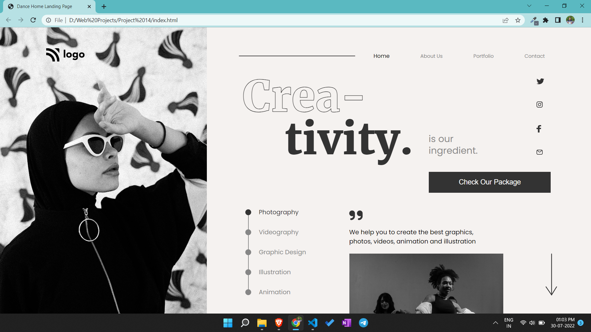

# Portfolio project 14

This is a one page portfolio template project made in HTML and CSS.

# Project live link

[Portfolio-project-14](https://statuesque-swan-f71da6.netlify.app)

# Screenshot

# My learnings from this projects

- I learned to make complex layouts using flex box.

# Time to finish the projecet

I took about 4 hours approximately to complete this project.
